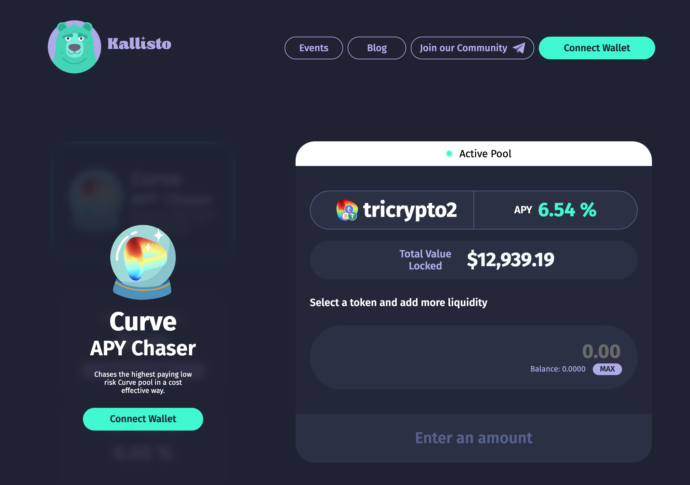
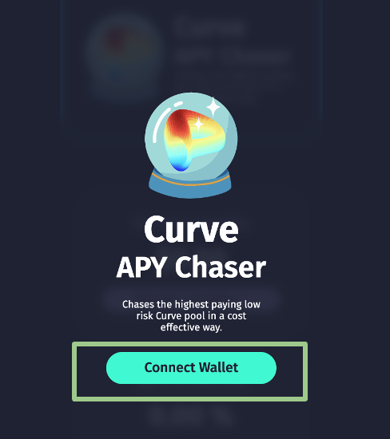
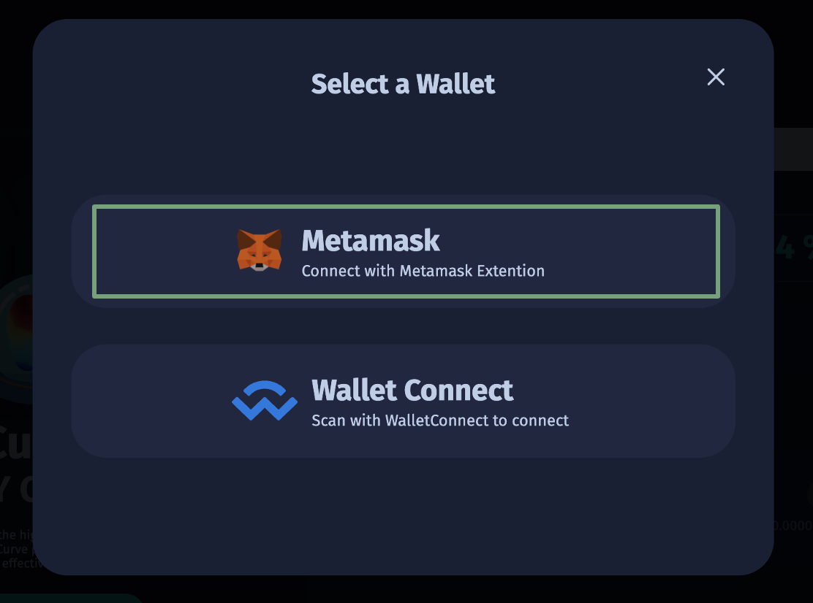
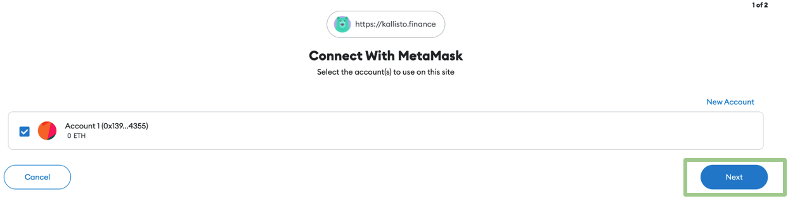
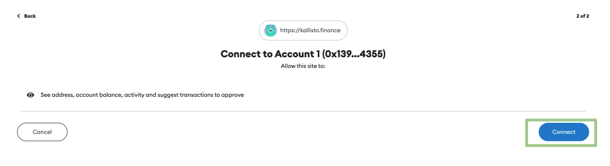
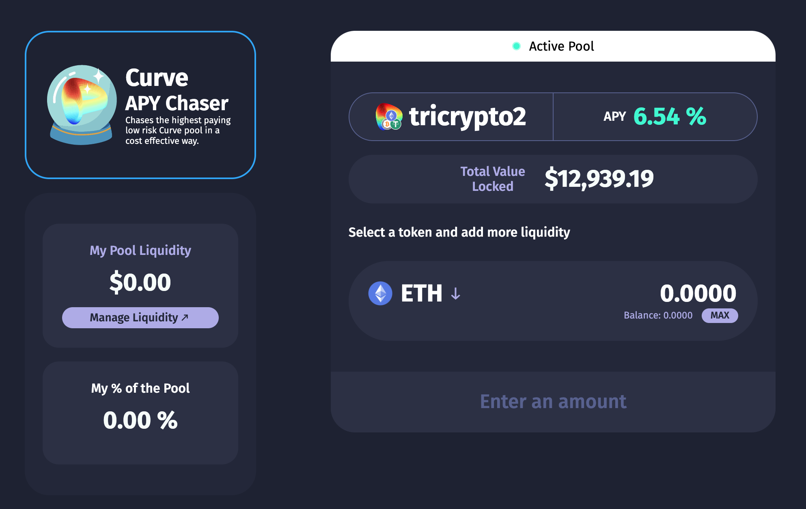
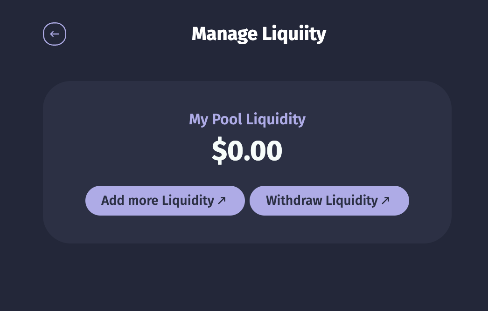

# How to use Kallisto

## Connect to Kallisto

Navigate to [kallisto.finance](https://kallisto.finance/).

Connect your wallet.

We are using MetaMask in this tutorial. Ensure that you have access
to your wallet on the browser you are using.

Select the account you would like to connect.

Ensure that you are connecting to official Kallisto finance dApp when
connecting your wallet.

You will see the vault dashboard that shows the active pool, 
the amount of liqudity your account is providing and how much of
the pool liqudity is yours.

On the dashboard, a user is able to manage their liqudity by either
adding or withdrawing assets.

## Deposits

If the user deposits a token other than a token of the main pool, Kallisto will swap the token to an 
allowable token using Curve’s swap router to find the optimal swap route. 

Upon a user’s deposit, the Kallisto vault adds liquidity to the main pool on Curve.

Users are always allowed to deposit:

- USDT
- wBTC
- WETH
- DAI
- USDC
- ETH
- stETH,

Users are allowed to deposit the following tokens if they are included in the Curve pool:

- renBTC
- FRAX
- MIM
- alETH

## Withdrawals

As removing liquidity always results in multiple tokens, the vault will swap using the optimal 
swap route provided by Curve’s swap router. Users can withdraw in two ways after removing 
liquidity:

1. Swap tokens into stablecoins for withdrawal
2. Return tokens that were moved from the target pool

Liqudity is removed as soon as a user withdraws.
